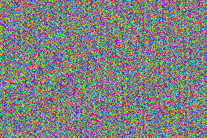
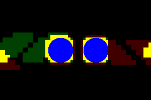
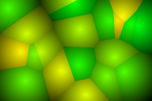

## Визуализация работы фильтра Блума
Я очень люблю визуализации алгоритмов. В основном это интеллектуальное развлечения, вид искуства. И, может быть, помогает лучше понять (или скорее почувствовать) работу алгоритма. Сначала я хотел визуализировать собственно фильтр Блума, но по ходу работы оказалось, что визуализация хешей может быть даже более интересной, так что про хеши тут будет больше.
Про фильтр Блума уже много написано, и кажется зачем снова о нем писать. Но как-то на лекции я увидел графическую иллюстрацию принципа работы фильтра, по которой должно было быть видно, что фильтр гарантированно пропускает все истинные значения, и плюс ещё какие-то. То есть множество истинных значений будет подмножеством того, что пропустит фильтр.

Здесь заштриховано множество правильных значений, а вокруг него обведена граница множества значений, которые пропускает фильтр (картинка была синим маркером). И я подумал, хорошо бы получить такую картинку "честно", напрямую визуализируя работу какой-то реализации фильтра Блума. Дальше будет рассказ об этом, с попутной визуализацией хеш-функций, ну и витражными пикселами в конце (мой шуточный термин).  

<cut />

Если подзабыли, как работает фильтр Блума, лучше сначала [почитать](https://habr.com/ru/articles/788772/) от этом.
В качестве элементов для фильтра можно взять точки на плоскости, а в качестве истинного множества – какую-нибудь узнаваемую фигуру, например, круг. Построим истинное множество:

Для параметров фильтра Блума важно знать коэффициент заполнение истинным множеством диапазона значений. Для выбранного круга он равен 2.075%.
В качестве хеш - функции хочется взять что-то, похожее на случайное. Псевдослучайный хеш от числа нашел на [Stackoverflow](https://stackoverflow.com/questions/664014/what-integer-hash-function-are-good-that-accepts-an-integer-hash-key). Числом для точки вполне может быть её номер (`x + y * WIDTH`).
Посмотрев на код хеш-функции, я заметил, что в ней трижды повторяется почти одна и та же операция: `v = (v shr 16 xor v) * 0x45d9f3b`. Конечно, сразу возник вопрос, почему именно трижды? Может, можно меньше? Или надо больше?
Для удобства отображения пока пусть значений хеша будет 256 (можно будет показывать одним цветовым каналом). Попробуем вариант с одной операцией. Посмотрим на значения hash-функции в каждой точке, используя для отображения одну компоненту цвета:

Видно, что хеш получился не слишком случайный, а хочется почему-то именно случайный, то есть с большим периодом и равномерно распределенный. Попробуем повторить операцию еще разок.

На глаз уже ничего не разобрать. Возможно, лучше использовать для отображения хеша существенно разные цвета?

Так даже хуже видно. Попробуем подсветить только одно значения хеша.

Теперь видно, что конкретные значения всё еще заметно периодичны. Придется добавить еще операцию. И снова посмотрим то же значения хеша:

Кажется, что хеш уже достаточно случаен. Хотя хорошо ли это -- не понятно, и мы ещё вернемся к этому вопросу. Перейдем уже собственно к фильтру.

Обучим фильтр и построим множество, которое он определяет. Точек у нас 300 x 200 = 60000, коэффициент заполнения 2%, и значит элементов фильтра потребуется хотя бы 12000 (20%).

Для наглядности поверх снова нарисуем истинное множество.

Что ж, визуализация состоялась. Можно посмотреть, как на картинку влияет изменение количества элементов фильтра (оно же -- количество значений хеша). Или увеличить количество разных хеш-функций.
Но хочется сделать картинку более похожей на КДПВ, там то ложно-положительная область фильтра была рядом с истинным множеством, а у нас получилось случайно разбросанная.

Давайте попробуем хеш-функцию сделать локальной. Например, просто разобьем картинку на квадраты и будем считать хешем номер квадрата, в который попала точка. Нарисуем для проверки какое-то количество значений такого хеша разными цветами.

Смотрится отлично! Теперь обучим фильтр с таким хешем. Только квадратики возьмем поменьше, 10 x 10, так что элементов фильтра будет всего 600. И истинный круг сделаем побольше, при локальной хеш-функции коэффициент заполнения на качество фильтра сильно не повлияет.

Вот теперь очень наглядно! И даже видно, что картинка похожа на обычное уменьшение разрешение (пикселизацию).

Вообще, фильтр Блума для монохромной картинки можно понимать как алгоритм сжатия данных с потерей информации: данные фильтра занимают меньше места, и по ним можно восстановить похожую картинку. И это первое нетривиальное наблюдение в этой статье.

Но возможности фильтра Блума гораздо шире, чем простая пикселизация. Тут, например, как раз интересно посмотреть, как выглядит использование нескольких хеш-функций (хотя бы двух). Количество хеш-функций даст второе измерение показателю "разрешение" (первое -- количество значений хеша). С другой стороны, можно поиграть с формой "пикселей": они совсем не обязаны быть прямоугольниками. Можно покрыть плоскость шестигранниками (построенные по фильтру изображения были бы менее угловатыми). А можно попытаться приблизиться к круглым пикселям (это челлендж!).

Начнем с нескольких хеш-функций. Вторую хеш-функций возьмём в принципе такую же, но сместим квадраты на половину стороны вправо и вниз. И для отображения значения функции будем использовать только один цветовой канал:

Так мы сможем показать сразу несколько (до трёх, но пока две) хеш-функций на одной картинке:

Здесь зелёным и красным каналами показаны значения двух хеш-функций -- "пикселизация" и "пикселизация" со смещением. И на вид кажется, что мы получили в два раза большее "разрешение" по обеим осям. Но цвет показывает только где значения функций одинаковое, а где разное. Надо ещё определиться с выбором конкретных значений, которые будут индексами битовой карты фильтра. Если использовать совпадающие значения (прямо номера квадратов), понять, за какую часть картинки отвечает какой хеш, будет трудно. Наиболее наглядно будет разделить диапазоны значений для каждой функции полностью. То есть по-сути сделать два последовательных отдельных фильтра. При этом объём данных фильтра только удвоился, а не учетверился, как было бы при использовании только одной хеш-функции и удвоенного "разрешения". Посмотрим на это всё, построив два фильтра Блума, используя две "пиксельные" хеш-функции с размером квадрата 20x20:

Темно-красным и темно-зелёным показаны результаты каждого фильтра отдельно. А жёлтым -- их пересечение. Выглядит, как будто мы получили картинку как при размере пикселя 10x10, но за вдвое меньший объём данных. Конечно, чудес не бывает, и это не совсем так. Даже на этой картинке можно заметить, что жёлтых пикселей получилось немного больше, чем с одной хеш-функцией (и меньшим пикселем). Но нагляднее будет сравнить немного другую картинку. Давайте в качестве истинного множества возьмем два близко расположенных круга. И построим картинку для фильтра с одной хеш-функцией и пикселем 10x10:

И вторую картинку, для двух последовательных фильтров с пикселем 20x20.

Теперь видно, что на второй картинке круги слиплись, а на первой "разрешения" хватило, чтобы показать их разделение. Дело в вероятностном характере фильтра Блума. В каких-то ситуациях везёт, и лишние пиксели не образуются. А в других ситуациях -- не везёт, как например между близко расположенными участками истинного множества. Можно сказать, что пикселизация в разных местах картинки с какой-то вероятностью может быть и 10x10, и 20x20. На ум приходят аналогии с квантовой запутанностью или фрактальной размерностью... ой, что это я, статья же не для Рен-тв. Давайте лучше посмотрим, как всё-таки выглядит полноценная экономия. То есть дадим хеш-функциям значения из единого диапазона и построим по ним один общий фильтр Блума:

Что ж, ложно-положительных результатов стало больше. Зато мы ещё в два раза уменьшили объём данных. Поведение конечно запуталось, картинка стала малопонятная. Но и по ней можно заметить кое-какие особенности работы Фильтра Блума. На картинке темно-зелёным и темно-красным всё так же обозначены отдельные совпадения по первой и по второй хеш-функции. Поскольку обе хеш-функции локальные, надо полагать, что далёкие от истинного множества совпадения получились, когда записано в фильтр значение было от одной хеш-функции, а совпало с другой. Вообще, наверно, все дополнительные (по сравнению с отдельными фильтрами) ложно-положительные срабатывания получились именно так, но это уже никак на картинке не видно.

Для очистки совести нарисуем ещё картинку, как выглядит две хеш - функции с пикселем 10x10. Добавление ещё одного хеша должно в теории картинку улучшить, и при этом ничего не стоит в плане объёма данных (по факту немножко добавляет, но это специфика выбора второй функции).

Да, всё плохо. Если присмотреться, можно даже найти место, где ожидаемый выигрыш случился (между кругами снизу). А в целом, вред от совпадений значений хеш-функций с запасом перевешивает. Возможно, хеш-функции выбраны неудачно. Но в любом случае вероятность совпадений очевидно будем меньше, если меньше будет степень заполнения фильтра, что в свою очереди определяется относительным размером истинного множества. Попробуем сделать круги поменьше.

Лучше стало, но теперь особенно заметно взаимное влияние хешей. Проблема похоже в том, что оба хеша локальные не только в том смысле, что коллизии расположены близко, но и сами значения хеша от соседних областей тоже рядом. А при таком как у нас характере истинного множества (много соседних элементов подряд) это сильно повышает вероятность паразитных совпадений. Попробуем значения одного из хешей перемешать (функционально заменить на псевдослучайные).

Не то чтобы ложно-положительных результатов стало меньше, но картинка веселее. И в целом она лучше иллюстрирует, что далёкие от истинного множества совпадения -- случайны. Кажется, мы достаточно показали капризный характер фильтра Блума, совесть очистилась, и можно просто порисовать что-нибудь красивое с использованием одной (но не обычной) хеш-функции.

Вроде где-то в середине статьи зашла речь про необычные пиксели, как возможности локальной хеш-функции. Проще всего организовать локальность как близость к какому-то "центру". Давайте накидаем таких центров на картинку случайным образом, и каждой точке сопоставим номер ближайшего центра как хеш. Так можно совместить локальность и случайность в каком-то смысле. И да, получится [диаграмма Вороного](https://en.wikipedia.org/wiki/Voronoi_diagram).
 

Не смог удержаться и отобразил расстояние от центра яркостью (ну и набор цветов подобрал для красоты). С такой градиентной заливкой, кстати, и центры примерно видны. Но совсем случайные центры могут дать сильно неравномерную сетку, с областями существенно разного размера. А ещё у меня есть идея в пограничной зоне как-то смешать соседние области, чтобы не было резких границ и углов.

 Пытаясь придумать совсем простое решение без резких границ, я какое-то время шёл в сторону хеш-функции на базе двух (а может и больше) ближайших к каждой точке центров. Интересно было бы посмотреть, как это выглядит, этакое развитие диаграммы Вороного в сторону эллипсов должно получаться. Но резкие границы тут всё равно будут (когда один центр из пары меняется на другой). А хочется плавных переходов между всеми соседними областями. А для этого соседей, как ни крути, надо искать.    

 Так что сложность (либо вычислительная, либо в реализации) нужных алгоритмов начинает беспокоить. И вот если вспомнить, что это просто хеш, а расположение центров вообще-то произвольно, хочется воспользоваться выбором центров для улучшения сетки и упрощения алгоритмов.

 Идея такая: возьмем равномерную квадратную сетку (как в уже использовавшемся ранее "пиксельном" хеше), и в каждом квадрате поставим 1 или 2 центра (количество и положение центров выберем псевдослучайно по номеру квадрата). Наверно, для равномерности ещё стоит от краёв квадратов немного отступать. Центры по квадрату можно будет дёшево находить (можно в хеш-таблицу сложить, или налету вычислять). А поиск соседних центров (и друг к другу, и к произвольной точке) можно будет ограничить только соседними квадратами. Соседних квадратов максимум 9, то есть проверять надо максимум 18 центров, и это допустимо сделать простым прямым перебором. Скорее всего такое уже делали, но как называется -- я не нашёл (если кто подскажет, буду признателен).

Построим сетку, центры и их приблизительную [триангуляцию Делоне](https://en.wikipedia.org/wiki/Delaunay_triangulation).

Ребра триангуляции соединяют только соседние центры. Для нахождения соседей берём всё центры из соседних ячеек сетки, и проверяем, что для точки на полпути между ними ближайшими центрами они и являются. То есть что середина ребра триангуляции находится на границе соседних областей диаграммы Вороного. Как видно, такой подход иногда дает сбой, если граница между областями не пересекает потенциальное ребро триангуляции. То есть некоторых соседей мы потеряем, но с этим можно смириться. 

kotlin-jupyter-kernel

